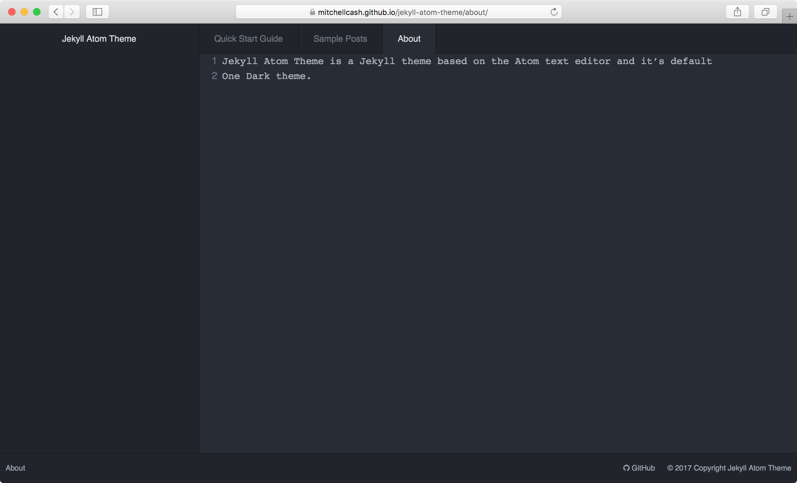

# [Jekyll Atom Theme](https://mitchellcash.github.io/jekyll-atom-theme/)

Jekyll Atom Theme is a Jekyll theme based on the Atom text editor and it's default One Dark theme.

## Development

To set up your environment to develop this theme, run `bundle install` inside both the `docs` and `test` folders.

| Command | Description |
| --- | --- |
| make | Build the theme demo and usage site inside `docs` |
| make preview | Start the built-in Jekyll preview for the theme demo and usage site inside `docs` |
| make dev | Build the theme test site inside `test` |
| make dev-preview | Start the built-in Jekyll preview for the theme test site inside `test` |

## TODO

- Responsive design
- Remove dependency on Materialize
- Better SEO support
- Google Analytics support
- Support the other default Atom themes as optional skins
- Drag and drop tabs?
- Line numbers in main content section

## License

The theme is available as open source under the terms of the [MIT License](https://opensource.org/licenses/MIT).
